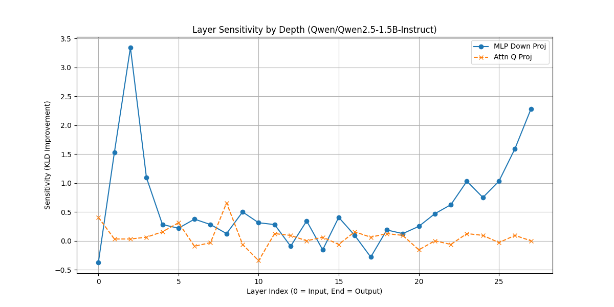
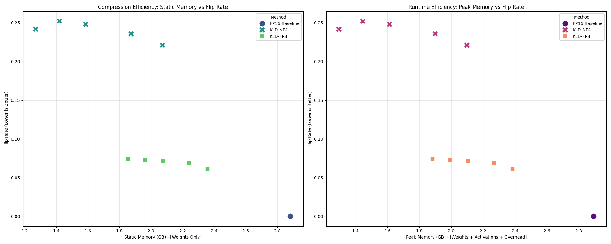
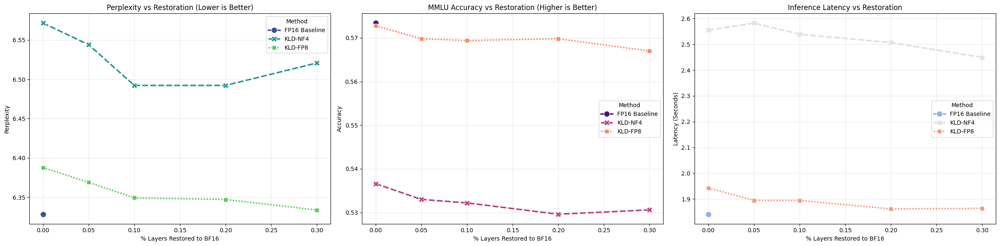
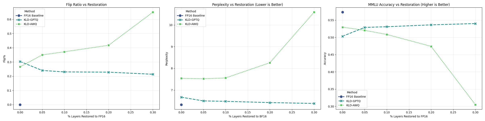
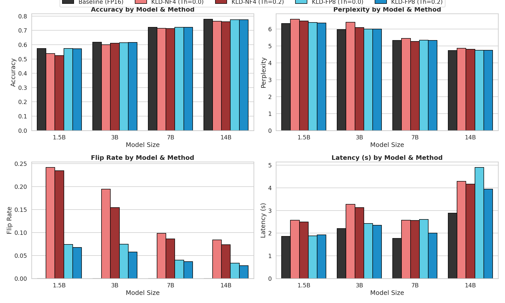

# Scaling LLMs Project: KLD-Guided Quantization for Efficient LLM Inference

## Team Information
- **Members**:
  - Jiayi Dong (jd4123@columbia.edu)
  - Yue Yang (yy3532@columbia.edu)

---

## 1. Problem Statement
The rapid evolution of Large Language Models (LLMs) has made deployment on consumer hardware difficult due to massive parameter counts. While Post-Training Quantization (PTQ) reduces memory costs, naive uniform quantization often degrades model reasoning. A critical issue is "answer flips"—cases where a quantized model changes a correct answer to an incorrect one—which standard metrics like perplexity often fail to capture.

This project addresses this reliability gap by proposing a Kullback-Leibler Divergence (KLD) guided mixed-precision quantization strategy. By profiling layer-wise sensitivity, we intelligently allocate higher precision (FP16/BF16) to sensitive layers while compressing robust layers to 4-bit or 8-bit formats.

---

## 2. Model & Methodology
**Architecture** \
We utilized the **Qwen2.5 model family** as our primary testbed, scaling from the 1.5B (Base) model up to 3B, 7B, and 14B parameter variants. The architecture consists of standard Transformer blocks (MSA and FFN/MLP).\

**Methodology: KLD-Guided Restoration**\
Our approach does not retrain weights. Instead, it employs a sensitivity profiling stage:
1. **Profiling:** We calculate the KLD between the output distribution of full-precision (FP16) layers and their quantized counterparts (NF4/FP8).
2. **Sensitivity Ranking:** Layers are ranked by KLD gain. Our analysis identified MLP down-projection layers as the most sensitive.
3. **Mixed-Precision Inference:** We apply base quantization (e.g., NF4) to the model and selectively "un-quantize" the top-N% most sensitive layers back to FP16.

**Algorithms Evaluated**
* **Base Quantization:** 4-bit NormalFloat (NF4), 8-bit Floating Point (FP8).
* **Advanced Optimization:** GPTQ, AWQ (Activation-aware Weight Quantization).

---

## 3. Repository Structure
```bash
├── archive/
│   ├── Final_Project.ipynb       # Deprecated/Exploratory notebooks
│   ├── MoreExperiements.ipynb
│   └── Project.ipynb
├── assets/                       # Plots
│
├── exp0_1_block.ipynb            # Experiment 1 variant: Block-level sensitivity analysis
├── exp0_1_layer.ipynb            # Experiment 1 (Primary): Layer-wise sensitivity profiling & restoration
├── exp2.ipynb                    # Experiment 2: Algorithm comparison (KLD + GPTQ/AWQ)
├── exp3.ipynb                    # Experiment 3: Scaling analysis across Qwen2.5 1.5B - 14B
│
├── requirements.txt              # Python dependencies (llmcompressor, transformers, etc.)
└── results/                      # Generated CSVs, and plots from experiments
```
---

## 4. Reproducibility Instructions

### A. Requirements

Install dependencies for local runs:
```bash
pip install -r requirements.txt
```
*Note: Key dependencies include `llmcompressor`, `torch`, `transformers`, and `datasets`.*

Colab dependencies are on notebooks

---

### B. Wandb Dashboard

View training and evaluation metrics here: https://wandb.ai/yq171014-columbia-university?shareProfileType=copy

---

### C. Running Experiments

The experiments are structured as Jupyter Notebooks. You can run them sequentially to reproduce the results.

1. **Sensitivity Profiling (Experiment 1)** Run exp0_1_layer.ipynb to profile the Qwen2.5-1.5B model.

* Input: Qwen2.5-1.5B-Instruct

* Output: Layer sensitivity plots and efficiency frontiers (Memory vs. Flip Rate).

2. **Algorithm Comparison (Experiment 2)** Run exp2.ipynb to compare KLD guidance with GPTQ and AWQ.

* This notebook quantizes the model using AutoGPTQ/AutoAWQ and applies layer restoration.

3. **Scaling Analysis (Experiment 3)** Run exp3.ipynb to test the larger model variants (3B, 7B, 14B).

* *Warning: This requires significant GPU memory (24GB+ recommended for 14B).*

---

### D. Final Results Summary

**Key Findings**
1. **NF4 vs. FP8:** NF4 is highly sensitive, requiring 20-30% layer restoration to reduce the flip rate, which significantly increases memory overhead (from ~1.25GB to ~2.1GB). FP8 is inherently more stable.
2. **Algorithm Compatibility:** KLD restoration works marginally well with GPTQ but causes catastrophic degradation with AWQ (perplexity spikes > 10.5) due to structural incompatibilities.
3. **Scaling Law:** Larger models (14B) are naturally robust to quantization. The 14B model maintains a flip rate < 10% even with aggressive quantization, reducing the need for mixed-precision restoration.

**Visualizations**

#### Figure 1: Layer Sensitivity Profiling (NF4)
Analysis of layer-wise KLD sensitivity for Qwen2.5-1.5B under 4-bit NormalFloat quantization. Peaks in KLD gain are concentrated in the early and late MLP down-projection layers, identifying them as the most vulnerable to quantization noise.



#### Figure 2: Efficiency Frontier (Flip Rate vs. Memory)
The "Sensitivity-Efficiency" frontier. NF4 (green X) initially exhibits a high flip rate (~0.25). Restoring sensitive layers reduces the flip rate but sharply increases static memory usage. FP8 (blue square) remains stable with minimal restoration.



#### Figure 3: Performance Trade-offs (Accuracy & Perplexity vs. Memory)
Impact of layer restoration on MMLU Accuracy and Perplexity relative to memory cost. While restoration improves perplexity for NF4, the memory overhead (growing from 1.25GB to 2.1GB) makes it less efficient than the FP8 baseline.



#### Figure 4: Algorithm Compatibility (GPTQ & AWQ)
Comparative analysis of KLD restoration on advanced quantization methods. KLD-GPTQ (blue) shows marginal improvement, while KLD-AWQ (green) suffers catastrophic degradation in accuracy and perplexity due to structural incompatibilities.



#### Figure 5: Model Scaling Analysis (1.5B to 14B)
Scaling behavior across the Qwen2.5 family. Larger models (14B) demonstrate inherent robustness to quantization, maintaining low flip rates and high accuracy even without extensive restoration, reducing the necessity for mixed-precision interventions.



---
